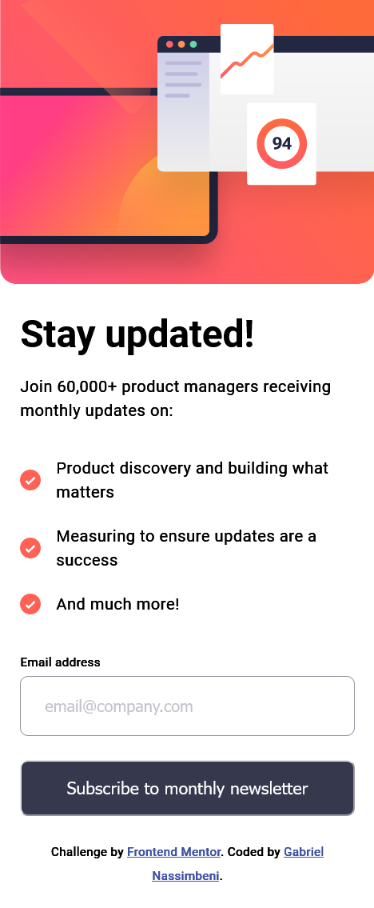

# Gabriel Nassimbeni - Newsletter sign-up form with success message solution

This is a solution to the [Newsletter sign-up form with success message challenge on Frontend Mentor](https://www.frontendmentor.io/challenges/newsletter-signup-form-with-success-message-3FC1AZbNrv).

## Table of contents

- [Overview](#overview)
  - [Screenshot](#screenshot)
  - [Links](#links)
  - [The challenge](#the-challenge)
- [My process](#my-process)
  - [Built with](#built-with)
  - [What I learned](#what-i-learned)
  - [Continued development](#continued-development)
  - [Useful resources](#useful-resources)
- [Author](#author)

## Overview

### Screenshot

### Links

- Solution URL: [https://github.com/gabprojects/Newsletter-challenge](https://github.com/gabprojects/Newsletter-challenge)
- Live Site URL: [https://gabprojects.github.io/Newsletter-challenge/](https://gabprojects.github.io/Newsletter-challenge/)

### The challenge

Users should be able to:

- Add their email and submit the form
- See a success message with their email after successfully submitting the form
- See form validation messages if:
  - The field is left empty
  - The email address is not formatted correctly
- View the optimal layout for the interface depending on their device's screen size
- See hover and focus states for all interactive elements on the page

## My process

### Built with

- Mobile-first workflow
- CSS custom properties
- Flexbox

### What I learned

I learned how to modify the styling of HTML elements based on user interactions. I utilized JavaScript to dynamically add and remove CSS classes, enabling the display of error messages when needed. These error messages would then be removed once the issue was resolved. Additionally, I undertook the challenge of using the project's local text sources, gaining valuable experience in their implementation. I encountered difficulties when implementing properties such as 'CSS gradient' and 'box shadow', as I experimented with various colors and techniques to achieve the desired design.

### Continued development

I aim to continually enhance my skills in manipulating the DOM using JavaScript and TypeScript. My goal is to work with intricate structures that can provide the optimal user experience.

### Useful resources

- [chatGPT](https://chat.openai.com/) - This AI is a powerful tool to help novice developers understand HTML Elements, CSS Properties and JavaScript Commands, and how to apply them to developing websites.
- [CSSgradient](https://cssgradient.io/) - Great site to test gradient CSS before implementing it in code.
- [Codepen](https://codepen.io/daph/pen/MydqQB) - Great site for configuring box-shadow before implementing it in code.

## Author

- Linkedin - [Gabriel Nassimbeni](https://www.linkedin.com/in/gabrieldoc/)
- Frontend Mentor - [@gabprojects](https://www.frontendmentor.io/profile/gabprojects)